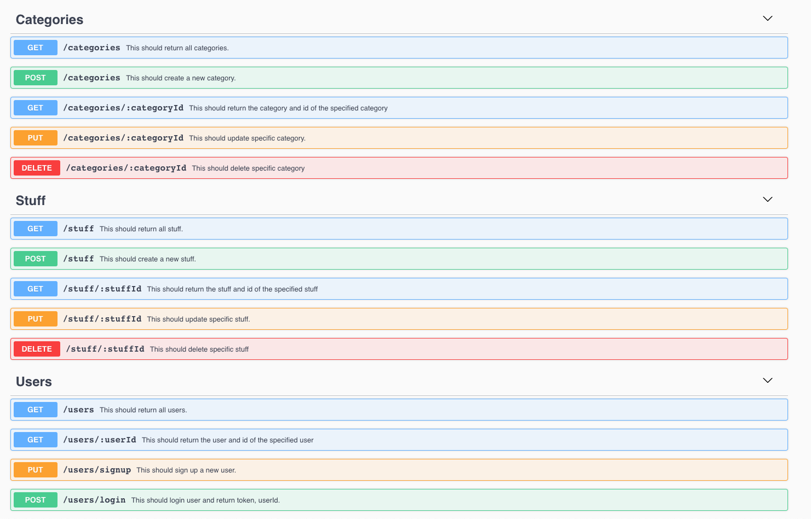

# Stuff Sharer API

## Instalace

- Naklonujte repositář pomocí příkazu `git clone https://github.com/fresh-js-devs/stuff-sharer-api.git`
- V adresáři naklonovaného repositáře spusťte příkaz `yarn`
- Ke spuštění aplikace použijte příkaz `yarn start`

## Databázová struktura

API obsahuje 3 modely (tabulky) User, Category, Stuff

## API Struktura

